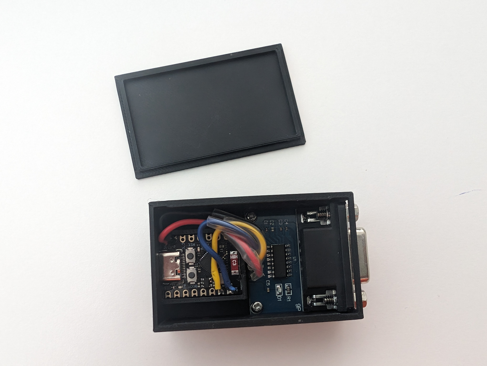

# Rotel ESPHome

## Introduction
This is an Esphome configuration for controling Rotel amplifiers using uart. 

I made the device with an ESP32-C3 super mini and a Max3232 Rs232 to TTL converter. I've put the components in a self designed case that is available in this repository.



## Wifi with the ESP32-C3 super mini
I had some problems with connecting the ESP32 to my wifi and maybe solved it with adding

```yaml
  output_power: 8.5
  power_save_mode: none
```
To the configuration.

## Available sensors
I only expose two sensors to Home Assistant (volume and input) because that was enough for me. You can use the protocol document to see what other data is available from the rs232 port. It shouldn't be hard to add those with the example from this repository.

## Cable
Don't forget that you need a nullmodem cable where the rx and tx are reversed. It won't work without it. I used a normal cable and a null modem converter.

## Reading the uart
I used [this](https://esphome.io/cookbook/lambda_magic.html#custom-uart-text-sensor) example for reading the uart but instead reading until a carriage return i read until a dollar ($) sign as stated in the protocol document. The amplifier doesn't send carriage returns.
